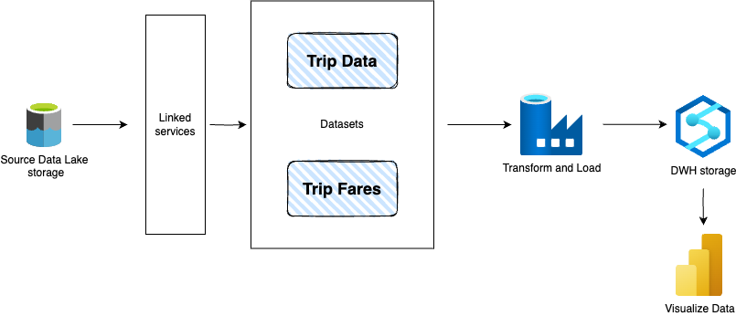

# E2E ETL pipeline using Azure 





## Technologies used

* Azure Data Lake Storage V2
* Azure Data Factory
* Azure Synapse Analytics
* PowerBi

## Prerequisites

* Python 3.13
* Terraform
* Active Azure subscription

## Description

This is the project to practice and demonstrate knowledge of building ETL pipelines using Azure cloud provider.

The provisioning of infrastructure is done using Terraform with needed network rules and role assignment. Additionally the user who is deploying has the ability to load and access all storage account and technnologies.

## Deploying:

```
terraform init

terraform plan \
-var="resource_group_name=<resource-group>" \
-var="location=<location>" \
-var="sql_admin_username=<username>" \
-var="sql_admin_password=<password>" \
-var="storage_account_name=<storage-account-name>" \
-var="data_factory_name=<factory-name>"

terraform apply \
-var="resource_group_name=<resource-group>" \
-var="location=<location>" \
-var="sql_admin_username=<username>" \
-var="sql_admin_password=<password>" \
-var="storage_account_name=<storage-account-name>" \
-var="data_factory_name=<factory-name>"
-var="client_ip=$(curl -4 ifconfig.me | awk -F% '{print $1}')"

```

## Additional scripts:

* [deploy_datasets.py](./deploy_datasets.py)

Description: A python script to deploy Datasets for transforming and loading data in Azure Data Factory.
User usage: A user can login in ADF Studio and develop the necessary pipelines with data. 
Running: 
```
python deploy_datasets.py
```

* [deploy_pipeline.py](./deploy_pipeline.py)

Description: A python script to deploy a test pipeline to transform Data.
User usage: ⚠️ WORK IN PROGRESS.


### Data: 
Taxi data about trips and fares of each ride.